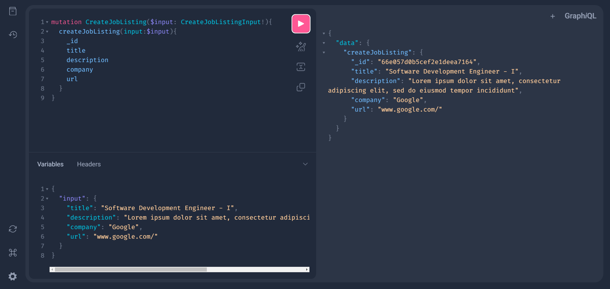

# Go JWT Auth Project

## Packages Used

1. github.com/99designs/gqlgen
2. github.com/vektah/gqlparser/v2
3. go.mongodb.org/mongo-driver
4. golang.org/x/crypto
5. github.com/google/uuid

### GraphQL User Interface

